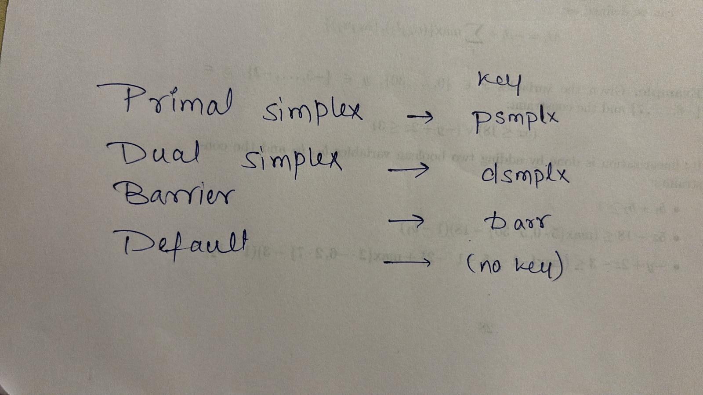

# THIS EVENING: @esthy13
- [ ] end your report part + write down conclusion section
- [ ] 22 entry for each cp/n.json --> check !!
- [ ] run angela part (EVERYTHING) + generate tables
- [ ] try to shrink the introduction
- [ ] add key syntax for json files in the README

# MISSING TASKS
- [ ] @ashmi less verbose in the report, focus on important details
- [ ] @asmi @angela add Cnum to the constraints in the report
- [ ] @jean check that the naming of the variables between the report and the code is consistent

# THIS MEETING:
- [x] Conclusion report defined: compare results in each validation section and conclusion section of the report

# SUBMISSION CHECKLIST (EVERYBODY)
- [ ]  Name your submission folder as CDMO Proj LastnameName1 ... LastnameNameK and upload its tgz or zip compressed archive. When working as a group, it suffices that only one group member submits the project, provided that the following information is provided in the submission comments:
  • all the members’ names, lastnames and UniBo e-mail addresses;
  • the impossible dates and time for discussion due to a hard constraint (like another exam, medical appointment, employment, urgent family matter).
- [ ]  file limit of 20 MB (use 7zip)
- [ ]  zip should include activation key

# COMPLETED:
- [x] missing tables for ashmi for objective function for all three solvers
- [x] run SMT for Jean with optimization: `python3 source/run_smt.py --range 2 12 --obj true --sb both` 
- [x] consistency across variables name for all models and report
- [x]  update readme file:
    - [x]  The instructions should concisely explain how to reproduce the result of a
    single model on a specific instance, without modifying the source code of your
    project; for instance, you could provide a script that takes as input arguments
    the instance number and/or the approach chosen. Moreover, you should also
    provide a way to run all the models on all the possible instances automatically,
    aiming to generate all the feasible results with a single operation.
- [x]  Ensure UNSAT is produced for n=4 across all models
- [x]  Any submission where the .json files containing the solutions:
  • cannot be processed by the checker, or
  • contain errors reported by the checker will be automatically rejected.
- [x]  Run official checker on ALL generated JSON files
- [x]  Verify all solvers produce valid outputs for tested n
- [x] finish to connect jean's part
- [x] add algorithms to tables
  
- [x] adjust the final readme
- [x] update tables for Angela with a new upperbound limit
- [x] unisci output di log fra i vari programmi!
  - Running CP model with solver gecode for obj=decision, sb=sb, strategy=base
  (no strategy if the solver has no strategy)
  - Result saved under 'z3_obj_!sb' to res/SAT/8.json
- [x] check checklist on notion!
- [x] tables for jean: from python3 source/run_smt.py --range 2 12 --obj false --sb true 
- [x] make tables for angela
- [x] check that there is timeout for angela
- [x] run ciplex for ashmi
- [x] run SMT for Jean without optimization
- [x] adjust tables for angela
- [x] connect angela's part
- [x] check that the docker works for Angela's part
- [x] adjust tables for ashmi if necessary and generate them
- [x] connect ashmi part
- [x] check that the docker works for jean's part
- [x] check that the docker works for Ashmi's part
- [x] connect jean part
- [x] adjust jean's part so that result in json is saved following the general naming rules
- [x] adjust tables for jean, why no result is printed
- [x] check how to save time/capture messages from the solver when result is
    - [x] UNKNOWN
    - [x] UNSAT
- [x] URGENT: there's an error with search_strategy flags and solver choice both from command line and code itself, error was related to how command line arguments were parsed
- [x] connect run_cp to main method, pay attention to manage well all the optional arguments &rarr; actually there's no need to connect again run_cp.py with main, the actual connnection is fine, but must be tested. You just need to write clear instruction for the professor on how to run the project and clear instructions for the github repo so it can be used for curriculum one day. Remember to fork/clone this repo in github one day!
- [x] print which kind of combination you're trying to solve at each moment
- [x] create table from a limited number of instances
- [x] correct table.py so that it understands from the json whether the instance was UNSAT or UNKNOWN and outputs the correct keywords in the table:
- [x] generazione files .json no decision optimization bensì obj e !obj
  json output example
  
  table example for the report
  
- [x] check table_v2 output is correct and check the naming of the output file cause I think there's an error!
- [x] run all combinations of chuffed + gecode_!sb_DWD+rand (check if others are missing!!)