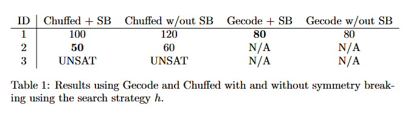

# Notes

## Stuff that I might still need to remember
- The best model with sb (no optimization and ff strategy) should work with chuffed until n <=16, parameters used:
  - config random seed =42
  - restart type geometric

# MISSING TASKS

THIS EVENING - ONGOING:
- [x] run ciplex for ashmi
- [x] run SMT for Jean without optimization

TOMORROW MORNING
- [ ] make tables for angela
- [ ] check that there is timeout for angela

TOMORROW
- [ ] missing scip tables for ashmi
- [ ] tables for jean: from python3 source/run_smt.py --range 2 12 --obj false --sb true 
- [ ] check the 300 seconds issue with optimization functions (whether you gave or not a lower bound to the optimization function or not)
- [ ] end your report part!
- [ ] adjust the final readme

- [ ] unisci output di log fra i vari programmi!
  - Running CP model with solver gecode for obj=decision, sb=sb, strategy=base
  (no strategy if the solver has no strategy)
  - Result saved under 'z3_obj_!sb' to res/SAT/8.json

TOMORROW EVENING:
- [ ] finish connecting jean's part
- [ ] run SMT for Jean with optimization: `python3 source/run_smt.py --range 2 12 --obj true --sb both` 
- [ ] check checklist on notion!

COMPLETED:
- [x] adjust tables for angela
- [x] connect angela's part
- [x] check that the docker works for Angela's part
- [x] adjust tables for ashmi if necessary and generate them
- [x] connect ashmi part
- [x] check that the docker works for jean's part
- [x] check that the docker works for Ashmi's part
- [x] connect jean part
- [x] adjust jean's part so that result in json is saved following the general naming rules
- [x] adjust tables for jean, why no result is printed
- [x] check how to save time/capture messages from the solver when result is
    - [x] UNKNOWN
    - [x] UNSAT
- [x] URGENT: there's an error with search_strategy flags and solver choice both from command line and code itself, error was related to how command line arguments were parsed
- [x] connect run_cp to main method, pay attention to manage well all the optional arguments &rarr; actually there's no need to connect again run_cp.py with main, the actual connnection is fine, but must be tested. You just need to write clear instruction for the professor on how to run the project and clear instructions for the github repo so it can be used for curriculum one day. Remember to fork/clone this repo in github one day!
- [x] print which kind of combination you're trying to solve at each moment

- [x] create table from a limited number of instances
- [x] correct table.py so that it understands from the json whether the instance was UNSAT or UNKNOWN and outputs the correct keywords in the table:

- [x] generazione files .json no decision optimization bensì obj e !obj

    json output example
    
    table example for the report
    

- [x] check table_v2 output is correct and check the naming of the output file cause I think there's an error!
- [x] run all combinations of chuffed + gecode_!sb_DWD+rand (check if others are missing!!)

Ideating the right prompt to connect my main to run_cp and making a scalable framework also for the other team members or just so I will know how to connect their methods to the main method
I might want to use an external file to specify all possible parameters so that the configuration is as easy as possible
or maybe I don't need all this complication, 

## How to run the project:
- If you want to run the project on all possible combinations for a certain number of teams you just need to run the main method. The only parameter you can edit in the main method is whether you'd like to run it on all four model, or just a combination of them, but you cannot specify a single strategy or solver for the selected interval
- use the single runners if you want to run a specific instance (or interval of instances) of a specific model, with a specific solver and if you want to select in detail what kind of model you want to use your programm
